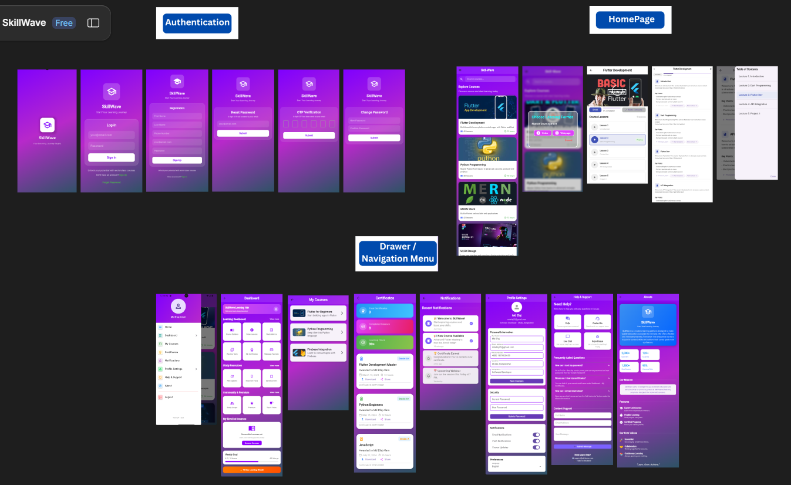
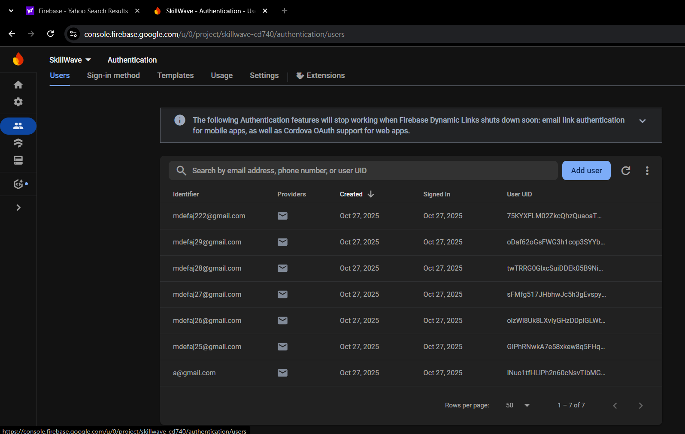

#  Learner Based Application ("flutterSdkVersion": "3.35.3")

A Flutter-based learning platform that allows users to access educational courses through 'video tutorials' and 'webpage tutorials', helping learners upskill efficiently.

---

##  Vision & Objectives
- Provide an easy-to-use learning platform for students and self-learners.
- Offer two flexible learning modes': video and web tutorials.
- Deliver a smooth navigation flow with modern Flutter UI.
- Build a scalable foundation for future features like progress tracking and admin panel.

---

##  Navigation Flow

Splash Screen
↓
Registration / Login
↓
Home Page (GridView of Courses)
↓
[On Tap Course] → Alert Dialog (Video / Webpage)
↓
Program Details (Video Player / WebView)
↓
Navigation Drawer → Profile / Dashboard

---

## 🧰 Tech Stack
- Framework: Flutter
- State Management: GetX
- Backend (Planned): Firebase Authentication & Firestore
- Version Control: Git & GitHub

---

## 📂 Folder Structure

lib/
├─ controllers/
├─ models/
├─ views/
├─ widgets/
├─ utils/
└─ main.dart
assets/
├─ images/

---

##  Target Users
- Students
- Self-learners
- Job seekers looking to upskill

---

##  Features (MVP)
- Splash Screen
- Registration/Login
- Course Grid View (Home Page)
- AlertDialog choice (Video / Webpage)
- Program Details Screen
- Drawer Navigation (Profile, Dashboard)

---

## 🎨 Figma (Link)

https://www.figma.com/design/yn3w8yOK1IoNHx6ILuJ2MQ/SkillWave?node-id=0-1&t=ZApwoXFUV4aHz9e1-1

## 📸 UI Image

  

  

## 📺 YouTube (Link)
Watch:  https://youtu.be/k1rT8PO-DlI?si=Vw8D2_DyBR08mN56

---

##  Version Control Evidence
-  Initial commit — “Initial Flutter project setup with folder structure”
-  Push to GitHub main branch
-  Repository Public

---

## 🧑‍💻 Author
 Md Efaj Alam 
📧 mdefaj25@gmail.com  
🌐 https://github.com/MirEfaj
🔗 LinkedIn : www.linkedin.com/in/efaj1
